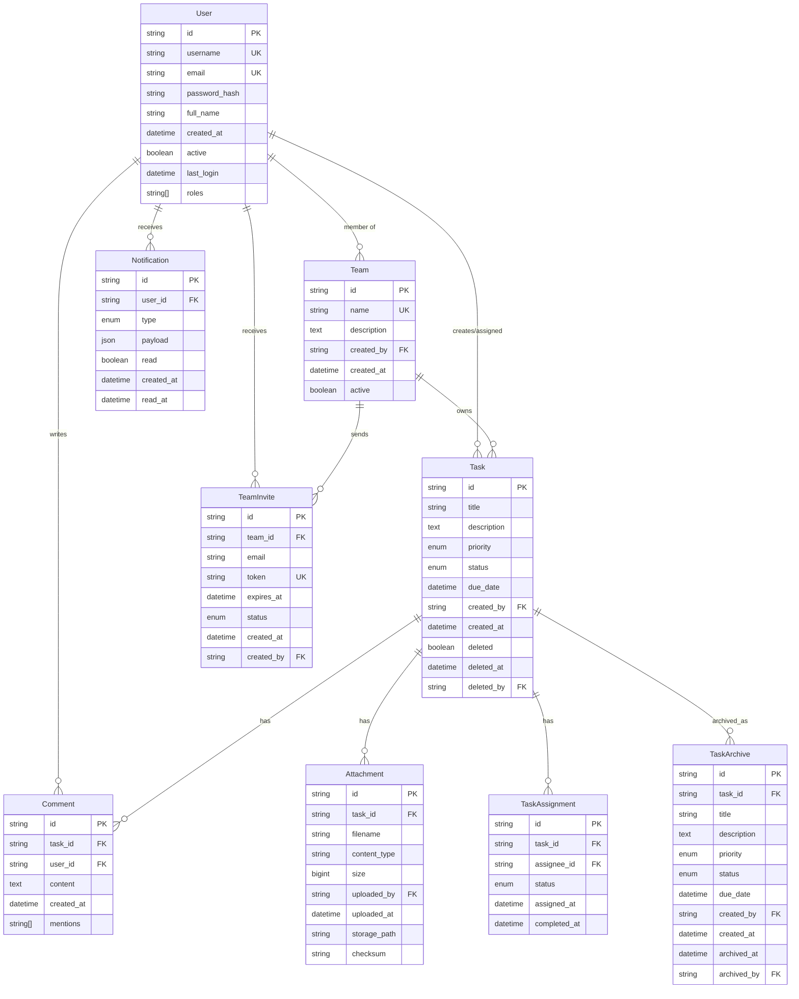

# Database Schema Design

## Entity Relationship Diagram

## Entity Details

### 1. User
- Primary entity for user management
- Stores authentication and profile information
- Roles determine access permissions
- Tracks user activity and status

### 2. Task
- Core entity for task management
- Implements soft delete with tracking
- Links to assignments, comments, and attachments
- Maintains audit trail

### 3. TaskAssignment
- Tracks task assignments and status
- Enables task reassignment history
- Records completion timestamps
- Links tasks to assignees

### 4. TaskArchive
- Historical record of completed tasks
- Preserves task state at completion
- Supports audit and reporting
- Maintains data integrity

### 5. Comment
- Supports task discussions
- Implements @mentions
- Tracks creation time
- Links to tasks and users

### 6. Attachment
- Manages file uploads
- Tracks file metadata
- Implements checksums for integrity
- Links files to tasks

### 7. Team
- Organizes users into teams
- Supports team hierarchies
- Tracks team creation and status
- Enables team-based access control

### 8. TeamInvite
- Manages team membership invitations
- Implements secure invite tokens
- Tracks invite status and expiration
- Links to teams and users

### 9. Notification
- Handles system notifications
- Supports multiple notification types
- Tracks read status
- Stores notification payload

## Relationships

### User Relationships
1. User → Task
   - One user can create many tasks
   - One user can be assigned many tasks
   - Bi-directional relationship

2. User → Comment
   - One user can write many comments
   - Comments are linked to their author

3. User → Team
   - Users can be members of multiple teams
   - Teams can have multiple users
   - Many-to-many relationship

### Task Relationships
1. Task → Comment
   - One task can have many comments
   - Comments belong to one task
   - One-to-many relationship

2. Task → Attachment
   - One task can have multiple attachments
   - Attachments belong to one task
   - One-to-many relationship

3. Task → TaskAssignment
   - One task can have multiple assignments (history)
   - Current assignment is active record
   - One-to-many relationship

### Team Relationships
1. Team → TeamInvite
   - One team can have multiple invites
   - Invites belong to one team
   - One-to-many relationship

2. Team → Task
   - Teams can own multiple tasks
   - Tasks can belong to one team
   - One-to-many relationship

## Indexing Strategy

### 1. Primary Indexes
- All `id` fields are primary keys
- UUIDs used for scalability
- Auto-generated on creation

### 2. Foreign Key Indexes
- All foreign key fields indexed
- Optimizes join operations
- Maintains referential integrity

### 3. Unique Indexes
- `User.username`
- `User.email`
- `Team.name`
- `TeamInvite.token`

### 4. Performance Indexes
- `Task.created_at`
- `Task.due_date`
- `Task.status`
- `Notification.user_id, Notification.read`
- `Comment.task_id, Comment.created_at`

## Data Types

### 1. String Fields
- `id`: UUID string (36 chars)
- `username`: VARCHAR(50)
- `email`: VARCHAR(255)
- `title`: VARCHAR(100)

### 2. Text Fields
- `description`: TEXT
- `comment.content`: TEXT
- `notification.payload`: JSONB

### 3. Enums
- `Task.priority`: LOW, MEDIUM, HIGH
- `Task.status`: PENDING, IN_PROGRESS, COMPLETED, BLOCKED
- `TeamInvite.status`: PENDING, ACCEPTED, REJECTED, EXPIRED

### 4. Timestamps
- All `*_at` fields: TIMESTAMP WITH TIME ZONE
- Stored in UTC
- Indexed where needed

## Constraints

### 1. NOT NULL Constraints
- All `id` fields
- `User.username`, `User.email`
- `Task.title`, `Task.created_by`
- `Team.name`, `Team.created_by`

### 2. Foreign Key Constraints
- ON DELETE: No physical deletions
- ON UPDATE: CASCADE for non-ID fields
- Maintains referential integrity

### 3. Check Constraints
- `Task.due_date` > `Task.created_at`
- `TeamInvite.expires_at` > `TeamInvite.created_at`
- `Attachment.size` > 0
